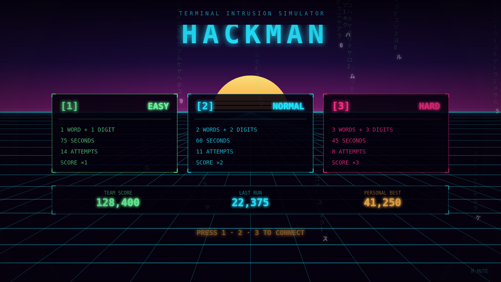
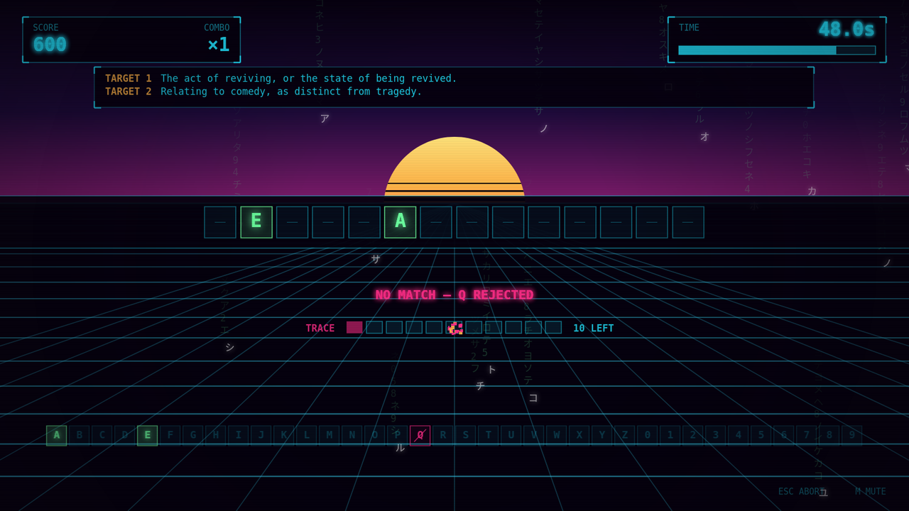
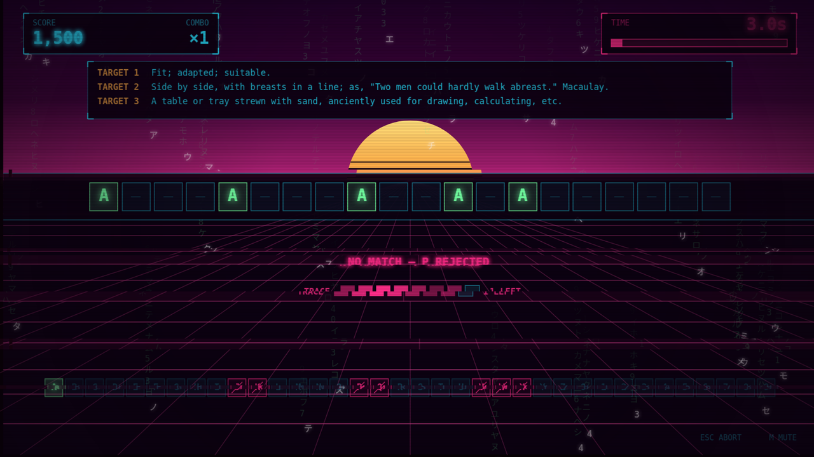

# Hackman

Crack the password before the trace finds you.

Hackman is a password-guessing game that lives entirely in one HTML file. Guess letters and digits to reveal a password assembled from dictionary words, working from the definitions as your only clue, against a countdown and a limited number of wrong guesses. Every miss advances the trace, and the world visibly degrades as it closes in.



## Play it

Open `hackman.html` in any modern browser. There is no build step, no install, and no server — double-clicking the file works, because nothing is fetched over the network.

If you would rather serve it:

```bash
python3 -m http.server 8000   # then open http://localhost:8000/hackman.html
```

## How it works

The password is one to three dictionary words joined together, with a digit appended per word. You are shown each word's dictionary definition and nothing else. Guess a letter or digit and every matching position reveals at once; guess wrong and the trace advances.



Consecutive correct guesses build a combo multiplier up to ×5, which a single miss resets — so the pressure is not just to finish, but to avoid guessing loosely on the way there.

## Controls

| Key | Action |
| --- | --- |
| `1` `2` `3` | Pick a difficulty and start a run |
| `A`–`Z`, `0`–`9` | Guess a letter or digit |
| `Esc` | Abandon the round without banking a score |
| `Space` | Continue from the results screen |
| `M` | Mute or unmute |

## Difficulty

| | Password | Time | Attempts | Score |
| --- | --- | --- | --- | --- |
| **Easy** | 1 word + 1 digit | 75s | 14 | ×1 |
| **Normal** | 2 words + 2 digits | 60s | 11 | ×2 |
| **Hard** | 3 words + 3 digits | 45s | 8 | ×3 |

## Scoring

Each correct guess scores `100 × occurrences revealed × combo × difficulty multiplier`. Cracking the password adds a bonus for every second left on the clock and every attempt you never spent; failing gets you neither.

Your team score accumulates across runs and, along with your personal best, is kept in `localStorage` — so it survives a reload but stays on that browser.

## Getting traced

Wrong guesses drive a single corruption value that feeds the whole scene: the sky shifts red, the rain thickens, the grid turns magenta and starts to jitter, and the frame tears sideways on each miss. The fail state is *detection*, so the pressure is meant to look like the system noticing you.



## The word list

Words live in a plain object at the bottom of `hackman.html`, mapping a word to its definition:

```js
var wordlist = {
  "abacus": "1. A table or tray strewn with sand, anciently used for drawing, calculating, etc.",
  "abdomen": "1. (Anat.)  The belly, or that part of the body between the thorax and the pelvis."
};
```

To add words, paste more entries in the same shape. Nothing reads the list directly — a filter runs once at startup and keeps only lowercase, letters-only entries between 4 and 9 characters, so entries outside that range are ignored rather than breaking a round. Definitions are shown in full, with the type size stepping down on the rare entry long enough to need it.

## Under the hood

One self-contained file, no dependencies and no assets. It holds a small 2D canvas engine, the game built on top of it, and the word list.

The whole scene is drawn procedurally each frame — the gradient sky, the sliced sun, the scrolling perspective grid, the glyph rain, the particles — and every sound is synthesised with the WebAudio API, so there is nothing to download and nothing to embed. Layout is authored against a fixed 1920×1080 space and letterboxed into the window with a single uniform scale, so it holds together at any size without stretching.

`CLAUDE.md` documents the architecture in more detail.
